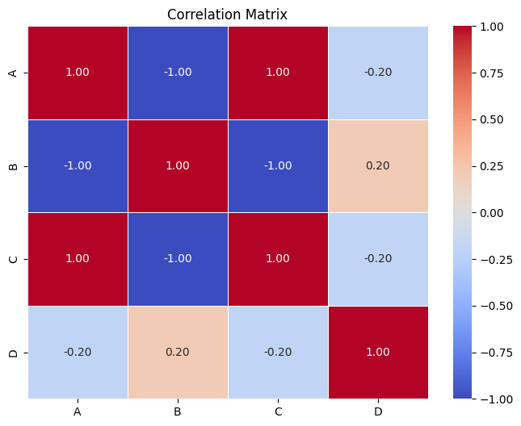

# Exploring NY Weather with Pandas and Matplotlib

This repository contains projects and analysis focused on exploring **New York weather data** using **Pandas** for data manipulation and **Matplotlib** for visualizing weather patterns. The analysis focuses on various aspects of weather data, including temperature, humidity, and precipitation over time.

The goal is to clean, analyze, and visualize the dataset to derive insights, identify trends, and detect anomalies in the New York weather patterns.

## Contents

- **Weather Data Cleaning and Preprocessing:** Clean and manipulate weather data using Pandas to handle missing values and format the data.
- **Visualization:** Create visualizations with Matplotlib to represent temperature trends, humidity levels, and precipitation over time.
- **Insights and Analysis:** Analyze the weather patterns and trends in New York, providing insights into climate and weather anomalies.
- **Datasets:** Weather data for New York (ensure you have access to the data in CSV or another format).

## 📸 Visualization Snapshot



## 🚀 How to Explore
1. Clone this repository:
   ```bash
   git clone https://github.com/Mallikarjun-B-Patil/Exploring-NY-Weather-with-Pandas-Matplotlib.git
